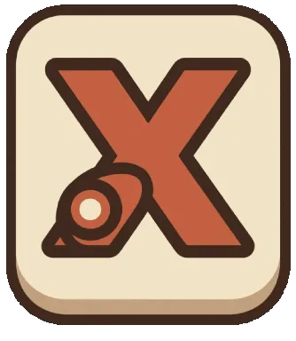

<div align="center">

  

  # 🎮 Xyven Launcher
  *Um launcher moderno, leve e eficiente para Minecraft: Java Edition.*

  <br />

  [](https://www.microsoft.com/windows)
  [](https://www.electronjs.org/)
  [](https://nodejs.org/)
  [](https://www.typescriptlang.org/)

</div>

---

## 📖 Sobre o Projeto

O **Xyven Launcher** é um cliente customizado para **Minecraft: Java Edition** no Windows, desenvolvido com **Electron** e **TypeScript**.

Ele gerencia automaticamente os arquivos oficiais da Mojang, checa a integridade via SHA-1 para garantir a segurança dos arquivos, utiliza sistema de cache para inicializações rápidas e executa o jogo de forma 100% nativa.

---

## ✨ Recursos

- 🎮 **Download & Execução:** Baixa e inicia instâncias do Minecraft sem complicações.
- ⚡ **Integridade & Cache:** Verificação rigorosa via SHA-1 para otimizar downloads.
- ☕ **Autodetecção de Java:** Encontra a versão ideal do JDK instalada no sistema.
- 👤 **Gerenciamento de Contas:** Suporte a contas Offline e Login Microsoft.
- 📟 **Console em Tempo Real:** Logs ao vivo para acompanhamento e suporte.
- 🌐 **Lista de Servidores:** Adicione e gerencie seus servidores favoritos.
- ⏱️ **Tempo de Jogo:** Contador automático de horas jogadas.

---

## 📥 Como Baixar e Jogar

Para quem quer apenas utilizar o launcher sem precisar compilar o código:

1. Acesse a **[Página da Última Release](https://github.com/ny3san331/xyven-launcher/releases/latest)**.
2. Baixe o executável da versão mais recente (`.exe` ou instalador).
3. Execute o arquivo e divirta-se!

---

## 🛠️ Tecnologias Utilizadas

<div align="center">

| Categoria | Tecnologias |
| :--- | :--- |
| **Framework** | `Electron` |
| **Linguagens** | `TypeScript` · `JavaScript` |
| **Runtime** | `Node.js` |
| **Bundler** | `Vite` |

</div>

---

## 💻 Desenvolvimento Local

Se você é desenvolvedor e deseja compilar ou contribuir com o projeto:

### Pré-requisitos
- **Node.js** (v20 ou superior)
- **JDK** (Java Development Kit)

### Passos para execução:

```bash
# Clone o repositório
git clone https://github.com/ny3san331/xyven-launcher.git

# Entre no diretório
cd xyven-launcher

# Instale as dependências
npm install

# Compile e inicie a aplicação
npm run build
npm start
```

---


---

## 🤝 Contribuidores

Agradecemos a todas as pessoas que contribuem para o desenvolvimento do **Xyven Launcher**:

<a href="https://github.com/Ny3san331/xyven-launcher/graphs/contributors">
  
</a>

<div align="center">

[](https://anthropic.com)

<sub>🤖 Projeto desenvolvido com o auxílio de **Inteligência Artificial (Claude)**.</sub>  
<sub>⚠️ Este é um projeto experimental/independente e não possui caráter 100% profissional.</sub>

<sub>Desenvolvido com ❤️ pela equipe do **Xyven Launcher**</sub>

</div>
